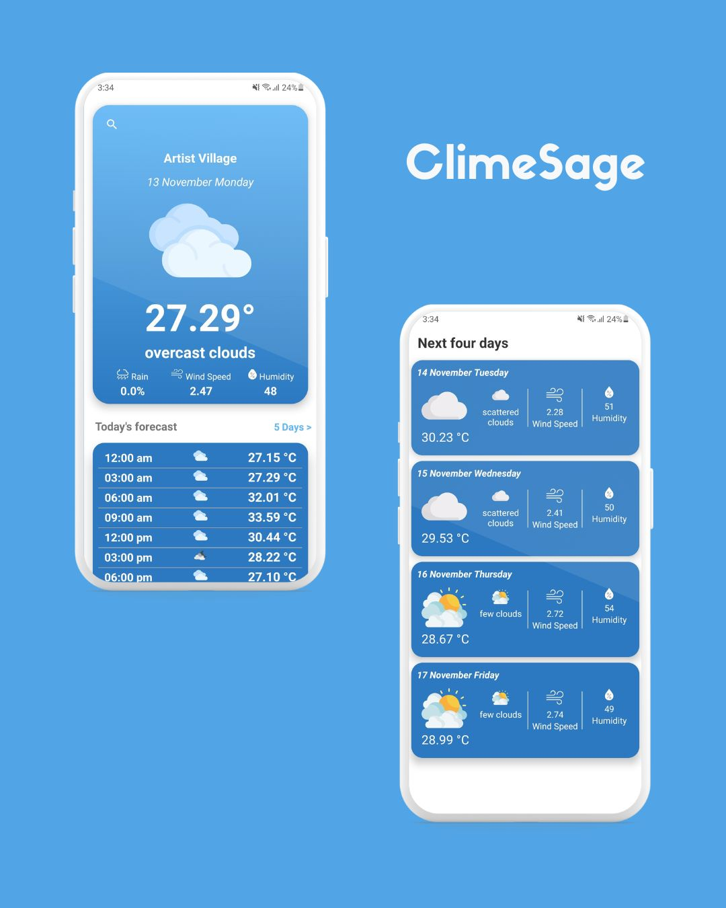

# ClimeSage | Weather App 🌦️

**An intuitive weather app powered by OpenWeather API, Retrofit, and Kotlin Coroutines.**

## Features 🌐

1. **Search Weather By Current Location** 📍
   - Fetch real-time weather data based on the user's current location.

2. **Search Weather By City** 🌍
   - Explore weather forecasts for different cities around the world.

## Forecast Details 📅

- **5 Days/3 hours Forecast** 📆
  - Utilizes OpenWeather API to provide detailed weather forecasts for the next 5 days at 3-hour intervals.

## Today's Forecast ☀️

- Today's forecast is intelligently extracted:
  - The system's current date is used to filter objects for today's weather.
  - Objects with weather data for today are stored in a dedicated list.

- **Current Weather Display** 🌟
  - The app determines the most relevant weather data for the current moment based on timestamps.

## Screenshots 📸

## Usage Instructions 🚀

1. **Insert API Key**
   - Before running the app, make sure to insert your OpenWeather API key.

2. **Dependencies**
   - Ensure all dependencies are correctly set up.

## Credits and Acknowledgments 🙌

- All weather icons are sourced from [Flaticon](https://www.flaticon.com/).

## How to Run 🏃‍♂️

1. Clone the repository.
2. Insert your OpenWeather API key.
3. Build and run the project.

Feel free to explore and contribute to making ClimeSage even better! 🚀
